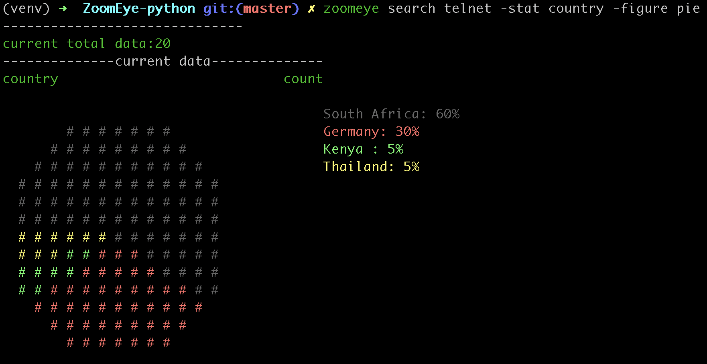
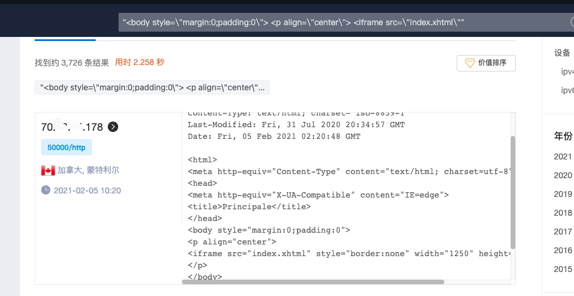

## ZoomEye-python

[English](../README.rst)｜中文文档

`ZoomEye` 是一款网络空间搜索引擎，用户可以使用浏览器方式 <https://www.zoomeye.org> 搜索网络设备。

`ZoomEye-python` 是一款基于 `ZoomEye API` 开发的 Python 库，提供了 `ZoomEye` 命令行模式，同时也可以作为 `SDK` 集成到其他工具中。该库可以让技术人员更便捷地**搜索**、**筛选**、**导出** `ZoomEye` 的数据。

### 0x01 安装步骤
可直接从 `pypi` 进行安装：

	pip3 install zoomeye

也可以通过 `github` 进行安装：

	pip3 install git+https://github.com/knownsec/ZoomEye-python.git


### 0x02 使用cli
在成功安装 `ZoomEye-python` 后，可以直接使用 `zoomeye` 命令，如下：

```
$ zoomeye -h
usage: zoomeye [-h] [-v] {info,search,init,ip,history,clear} ...

positional arguments:
  {info,search,init,ip,history,clear}
    info                Show ZoomEye account info
    search              Search the ZoomEye database
    init                Initialize the token for ZoomEye-python
    ip                  Query IP information
    history             Query device history
    clear               Manually clear the cache and user information

optional arguments:
  -h, --help            show this help message and exit
  -v, --version         show program's version number and exit

```

#### 1.初始化token
在使用 `ZoomEye-python cli` 前需要先初始化用户 `token`，该凭证用于验证用户身份以便从 `ZoomEye` 查询数据；我们提供了两种认证方式：

	1.username/password
	2.APIKEY (推荐)

可以通过 `zoomeye init -h` 查看帮助，下面通过 `APIKEY` 来进行演示：

```
$ zoomeye init -apikey "01234567-acbd-00000-1111-22222222222"
successfully initialized
Role: developer
Quota: 10000
```

用户可以通过登陆 `ZoomEye` 在个人信息中(<https://www.zoomeye.org/profile>) 获取 `APIKEY`；`APIKEY` 不会过期，用户可根据需求在个人信息中进行重置。

除此之外，我们还提供了 `username/password` 的初始化方式，通过这种方式认证后会返回 `JWT-token`，具有一定的时效性，失效后需要用户重新登陆。

#### 2.查询配额
用户可以通过 `info` 命令查询个人信息以及数据配额，如下：

```
$ zoomeye info
user_info: {
    "email": "",  # 用户邮箱
    "name": "",  # 用户名
    "nick_name": "",  # 昵称
    "api_key": "",  # api_key
    "role": "",  # 服务级别
    "phone", "",  # 用户注册手机号
    "expired_at": ""  # 服务期限
}
quota: {
    "remain_free_quota": "",  # 本月剩余免费额度
    "remain_pay_quota": "",  # 本月剩余支付额度
    "remain_total_quota": ""  # 截止到服务日期剩余总额度
}
```

#### 3.搜索
搜索是 `ZoomEye-python` 最核心的功能，通过 `search` 命令进行使用。`search` 命令需要指定搜索关键词(`dork`)，下面我们进行简单的搜索：

```
$ zoomeye search "telnet" -num 1
ip:port       service  country  app                 banner                        
222.*.*.*:23  telnet   Japan    Pocket CMD telnetd  \xff\xfb\x01\xff\xfb\x03\xff\x...

total: 1/58277850
```

使用 `search` 命令和使用浏览器在 `ZoomEye` 进行搜索一样简单，在默认情况下我们显示了较为重要的 5 个字段，用户可以使用这些数据了解目标信息：

	1.ip:port  ip地址和端口
	2.service  该端口开放的服务
	3.country  该ip地址所属国家
	4.app      识别出的应用类型
	5.banner   该端口的特征响应报文

在以上演示中，使用 `-num` 参数指定了显示的数量，除此之外，`search` 还支持以下参数(`zoomeye search -h`)，以便用户对数据进行处理，我们将在下文进行说明和演示：

	-num     设置显示/搜索的数量，支持 all
	-count   查询该 dork 在 ZoomEye 数据库的总量
	-facet   查询该 dork 全量数据的分布情况
	-stat    统计数据结果集的分布情况
	-filter  查询数据结果集中某个字段的详情，或根据内容进行筛选
	-save    可按照筛选条件将结果集进行导出
	-force	 忽略本地缓存文件，直接从 ZoomEye 获取数据
    -type    指定搜索源，host 或 web

#### 4.数据数量
通过 `-num` 参数可以指定我们搜索和显示的数量，指定的数目即消耗的配额数量。而通过 `-count` 参数可以查询该 `dork` 在 ZoomEye 数据库的总量，如下：

```
$ zoomeye search "telnet" -count
56903258
```

>需要注意一点，`-num` 参数消耗的配额为 20 的整数倍，这是因为 `ZoomEye API` 单次查询的最小数量为 20 条。

#### 5.数据聚合
我们可以通过 `-facet` 和 `-stat` 进行数据的聚合统计，使用 `-facet` 可以查询该 dork 全量数据的聚合情况(由 `ZoomEye` 聚合统计后通过 `API` 获取)，而 `-stat` 可以对查询到的结果集进行聚合统计。两个命令支持的聚合字段包括：
    
    # host search 
	app      按应用类型进行统计
	device   按设备类型进行统计
	service  按照服务类型进行统计
	os       按照操作系统类型进行统计
	port     按照端口进行统计
	country  按照国家进行统计
	city     按照城市进行统计

    # web search
    webapp      按照 Web 应用进行统计
    component   按照 Web 容器进行统计
    framework   按照 Web 框架进行统计
    server      按照 Web 服务器进行统计
    waf         按照 Web 防火墙(WAF)进行统计
    os          按照操作系统进行统计
    country     按照国家进行统计

使用 `-facet` 统计全量 `telnet` 设备的应用类型：

```
$ zoomeye search "telnet" -facet app
app                                count
[unknown]                          28317914
BusyBox telnetd                    10176313
Linux telnetd                      3054856
Cisco IOS telnetd                  1505802
Huawei Home Gateway telnetd        1229112
MikroTik router config httpd       1066947
Huawei telnetd                     965378
Busybox telnetd                    962470
Netgear broadband router...        593346
NASLite-SMB/Sveasoft Alc...        491957
```

使用 `-stat` 统计查询出来的 20 条 `telnet` 设备的应用类型：

```
$ zoomeye search "telnet" -stat app
app                                count               
Cisco IOS telnetd                  7
[unknown]                          5
BusyBox telnetd                    4
Linux telnetd                      3
Pocket CMD telnetd                 1
```

#### 6.数据筛选

使用 `-filter` 参数可以查询数据结果集中某个字段的详情，或根据内容进行筛选，该命令支持的字段包括：

    # host/search
	app          显示应用类型详情
	version      显示版本信息详情
	device       显示设备类型详情
	port         显示端口信息详情
	city         显示城市详情
	country      显示国家详情
	asn          显示as number详情
	banner       显示特征响应报文详情
	timestamp    显示数据更新时间
	*            在包含该符号时，显示所有字段详情

    # web/search
    app         显示应用类型详情
    headers     HTTP 头
    keywords    meta 属性关键词
    title       HTTP Title 标题信息
    site        site 搜索
    city        显示城市详情
    country     显示国家详情
    webapp      Web 应用
    component   Web 容器
    framework   Web 框架
    server      Web 服务
    waf         Web 防火墙(WAF)
    os          操作系统
    timestamp   显示数据更新时间
    *           在包含该符号时，显示所有字段详情


相比较默认情况下的省略显示，所以通过 `-filter` 可以查看完整的数据，如下：

```
$ zoomeye search "telnet" -num 1 -filter banner
ip         banner                        
222.*.*.*  \xff\xfb\x01\xff\xfb\x03\xff\xfd\x03TELNET session now in ESTABLISHED state\r\n\r\n

total: 1
```

使用 `-filter` 进行筛选时，语法为：`key1,key2,key3=value`，其中 `key3=value` 为筛选条件，而展示的内容为 `key1,key2` 例：
```
$ zoomeye search telnet -num 1 -filter port,app,banner=Telnet

ip                        port                          app                           
240e:*:*:*::3             23                            LANDesk remote management     

total: 1
```

在上面的示例中：`banner=Telnet` 为筛选的条件，而 `port,app` 为展示的内容。如果需要展示 `banner`，筛选语句则是这样

```
$ zoomeye search telnet -num 1 -filter port,app,banner,banner=Telnet
```


#### 7.数据导出
`-save` 参数可以对数据进行导出，该参数的语法和 `-filter` 一样，并将结果按行 json 的格式保存到文件中，如下：

```
$ zoomeye search "telnet" -save banner=telnet
save file to telnet_1_1610446755.json successful!

$ cat telnet_1_1610446755.json
{'ip': '218.223.21.91', 'banner': '\\xff\\xfb\\x01\\xff\\xfb\\x03\\xff\\xfd\\x03TELNET session now in ESTABLISHED state\\r\\n\\r\\n'}
```

>如果使用 `-save` 但不带任何参数，则会将查询结果按照 `ZoomEye API` 的 json 格式保存成文件，这种方式一般用于在保留元数据的情况下进行整合数据；该文件可以作为输入通过 `cli` 再次解析处理，如 `zoomeye search "xxxxx.json"`。

#### 8. 数据图像化

`-figure` 参数为数据图像化参数，该参数提供了 `pie(饼图)` 和  `hist(柱状图)` 两种展示方式，在没有进行指定依旧显示数据，在指定  `-figure` 时，只会显示图形。饼图如下：




柱状图如下：


> 注意：仅能在 `-facet` 和 `-stat` 数据聚合的情况使用。

#### 9. IP 历史数据查看

`ZoomEye-python` 提供了 IP 历史设备数据查询功能，使用命令 `history [ip]` 便能查询 IP 设备历史数据，使用方式如下：

```
$zoomeye history "207.xx.xx.13" -num 1
207.xx.xx.13
Hostnames:                    [unknown]
Country:                      United States
City:                         Lake Charles
Organization:                 fulair.com
Lastupdated:                  2021-02-18T03:44:06
Number of open ports:         1
Number of historical probes:  1

timestamp                  port/service               app                        raw_data                   
2021-02-18 03:44:06        80/http                    Apache httpd               HTTP/1.0 301 Moved Permanently...
```

在默认情况下向用户较为重要的六个字段：

```
1. time		记录的时间
2. service	开放的服务
3. port		端口
4. app  	Web 应用
5. banner   原始的指纹信息 
```

使用 `zoomeye history -h`  可以查看 `history` 提供的参数。

```
$zoomeye history -h

usage: zoomeye history [-h] [-filter filed=regexp] [-force] ip

positional arguments:
  ip                    search historical device IP

optional arguments:
  -h, --help            show this help message and exit
  -filter filed=regexp  filter data and print raw data detail. field:
                        [time,port,service,app,raw]
  -force                ignore the local cache and force the data to be
                        obtained from the API
```

下面对 `-filter` 进行演示：

```
$zoomeye history "207.xx.xx.13" -filter "time=^2019-08,port,service"
207.xx.xx.13
Hostnames:                    [unknown]
Country:                      United States
City:                         Lake Charles
Organization:                 fulair.com
Lastupdated:                  2019-08-16T10:53:46
Number of open ports:         3
Number of historical probes:  3

time                       port                       service                    
2019-08-16 10:53:46        389                        ldap                       
2019-08-08 23:32:30        22                         ssh                        
2019-08-03 01:55:59        80                         http 
```

`-filter` 参数支持以下五个字段的筛选：

```
1.time      扫描时间
2.port      端口信息
3.service   开放的服务
4.app       Web 应用
5.banner    原始指纹信息
6.ssl       证书信息
7.*         在包含该符号时，显示所有字段详情
```

在展示时添加了一个 `id` 字段的展示，`id` 为序号，为了方便查看，并不能作为筛选的字段。

> 注意：目前只开放了上述五个字段的筛选。   
> 使用 `history` 命令时同样会消耗用户配额，在 `history` 命令中返回多少条数据，用户配额就相应扣除多少。例如：IP "8.8.8.8" 共有 944 条历史记录，查询一次扣除 944 的用户配额。


#### 10.查询 IP 信息
可以通过 `zoomeye ip` 命令查询指定 IP 的信息，例如：
```
$ zoomeye ip 185.*.*.57
185.*.*.57
Hostnames:                    [unknown]
Isp:                          [unknown]
Country:                      Saudi Arabia
City:                         [unknown]
Organization:                 [unknown]
Lastupdated:                  2021-03-02T11:14:33
Number of open ports:         4{2002, 9002, 123, 25}

port      service        app                    banner                        
9002      telnet                                \xff\xfb\x01\xff\xfb\x0...    
123       ntp            ntpd                   \x16\x82\x00\x01\x05\x0...    
2002      telnet         Pocket CMD telnetd     \xff\xfb\x01\xff\xfb\x0...    
25        smtp           Cisco IOS NetWor...    220 10.1.10.2 Cisco Net...   
```

`zoomeye ip` 命令同样支持筛选参数 `-filter`, 语法和 `zoomeye search` 的筛选语法一致。例如：
```
$ zoomeye ip "185.*.*.57" -filter "app,app=ntpd"
Hostnames:                    [unknown]
Isp:                          [unknown]
Country:                      Saudi Arabia
City:                         [unknown]
Organization:                 [unknown]
Lastupdated:                  2021-02-17T02:15:06
Number of open ports:         0
Number of historical probes:  1

app                        
ntpd              
```

`filter` 参数支持的字段有:

```
    port        端口信息
    service     运行服务
    app         应用
    banner      指纹信息
```

> 注意：此功能根据不同用户等级，对每个用户每天查询次数做了一定的限制。
>
> **注册用户和开发者每天能够查询 10 次**
> 
> **高级用户每天可查询 20 次**
> 
> **VIP 用户每天可以查询 30 次**
> 
> 每天的次数使用完之后，24小时后刷新，即从第一次查 IP 的时间开始计算，24小时后刷新次数。


#### 11.清理功能
用户每天都会搜索大量的数据，这样就导致缓存文件夹所占的存储空间逐渐增大；如果用户在公共服务器上使用 `ZoomEye-python` 可能会导致自己的 `API KEY` 和 `ACCESS TOKEN` 泄漏。
为此 `ZoomEye-python` 提供了清理命令 `zoomeye clear`，清理命令可以缓存数据和用户配置进行清空。使用方式如下：

```
$zoomeye clear -h
usage: zoomeye clear [-h] [-setting] [-cache]

optional arguments:
  -h, --help  show this help message and exit
  -setting    clear user api key and access token
  -cache      clear local cache file
```


#### 12.缓存机制

`ZoomEye-python` 在 `cli` 模式下提供了缓存机制，位于 `~/.config/zoomeye/cache` 下，尽可能的节约用户配额；用户查询过的数据集将在本地缓存 5 天，当用户查询相同的数据集时，不会消耗配额。

#### 13.域名查询
`ZoomEye-python` 提供了域名查询功能(包括关联域名查询和子域名查询功能), 使用命令 `domain [域名] [查询类型]` 便能进行域名查询，使用方式如下：

```
$ python cli.py domain baidu.com 0
name                                                   timestamp      ip
zszelle.baidu30a72.bf.3dtops.com                       2021-06-27     204.11.56.48
zpvpcxa.baidu.3dtops.com                               2021-06-27     204.11.56.48
zsrob.baidu.3dtops.com                                 2021-06-27     204.11.56.48
zw8uch.7928.iwo7y0.baidu82.com                         2021-06-27     59.188.232.88
zydsrdxd.baidu.3dtops.com                              2021-06-27     204.11.56.48
zycoccz.baidu.3dtops.com                               2021-06-27     204.11.56.48
...

total: 30/79882
```

在默认情况下为用户展示较为重要的三个字段：
```
1. name             域名全称
2. timestamp        建立时间戳
3. ip               ip地址
```

使用 `zoomeye domain -h` 可以查看 `domain` 提供的参数。
```
$ python cli.py domain -h
usage: zoomeye domain [-h] [-page PAGE] q {0,1}

positional arguments:
  q           search key word(eg:baidu.com)
  {0,1}       0: search associated domain;1: search sub domain

optional arguments:
  -h, --help  show this help message and exit
  -page PAGE  view the page of the query result

```

下面对 `-page` 进行演示：(不指定时默认查询第一页)

```
$ python cli.py domain baidu.com 0 -page 3
name                                                   timestamp      ip
zvptcfua.baidu6c7be.mm.3dtops.com                      2021-06-27     204.11.56.48
zmukxtd.baidu65c78.iw.3dtops.com                       2021-06-27     204.11.56.48
zhengwanghuangguanxianjinkaihu.baidu.fschangshi.com    2021-06-27     23.224.194.175
zibo-baidu.com                                         2021-06-27     194.56.78.148
zuwxb4.jingyan.baidu.66players.com                     2021-06-27     208.91.197.46
zhannei.baidu.com.hypestat.com                         2021-06-27     67.212.187.108
zrr.sjz-baidu.com                                      2021-06-27     204.11.56.48
zp5hd1.baidu.com.ojsdi.cn                              2021-06-27     104.149.242.155

...

zhidao.baidu.com.39883.wxeve.cn                        2021-06-27     39.98.202.39
zhizhao.baidu.com                                      2021-06-27     182.61.45.108
zfamnje.baidu.3dtops.com                               2021-06-27     204.11.56.48
zjnfza.baidu.3dtops.com                                2021-06-27     204.11.56.48

total: 90/79882
```


### 0x03 演示视频
[在 Windows、Mac、Linux、FreeBSD 演示视频](https://video.weibo.com/show?fid=1034:4597603044884556)

[](https://asciinema.org/a/qyDaJw9qQc7UjffD04HzMApWa)


### 0x04 使用SDK
#### 1.初始化token
同样，在 SDK 中也支持 `username/password` 和 `APIKEY` 两种认证方式，如下：

**1.user/pass**

```python
from zoomeye.sdk import ZoomEye

zm = ZoomEye(username="username", password="password")
```

**2.APIKEY**

```python
from zoomeye.sdk import ZoomEye

zm = ZoomEye(api_key="01234567-acbd-00000-1111-22222222222")
```

#### 2.SDK API
以下是 SDK 提供的接口以及说明：

	1.login()
	  使用 username/password 或者 APIKEY 进行认证
	2.dork_search(dork, page=0, resource="host", facets=None)
	  根据 dork 搜索指定页的数据
	3.multi_page_search(dork, page=1, resource="host", facets=None)
	  根据 dork 搜索多页数据
	4.resources_info()
	  获取当前用户的信息
	5.show_count()
	  获取当前 dork 下全部匹配结果的数量
	6.dork_filter(keys)
	  从搜索结果中提取指定字段的数据
	7.get_facet()
	  从搜索结果中获取全量数据的聚合结果
	8.history_ip(ip)
	  查询某个 ip 的历史数据信息
	9.show_site_ip(data)
	  遍历 web-search 结果集，并输出域名和ip地址
	10.show_ip_port(data)
	  遍历 host-search 结果集，并输出ip地址和端口

#### 3.使用示例

```python
$ python3
>>> import zoomeye.sdk as zoomeye
>>> dir(zoomeye)
['ZoomEye', 'ZoomEyeDict', '__builtins__', '__cached__', '__doc__',
'__file__', '__loader__', '__name__', '__package__', '__spec__',
'fields_tables_host', 'fields_tables_web', 'getpass', 'requests',
'show_ip_port', 'show_site_ip', 'zoomeye_api_test']
>>> # Use username and password to login
>>> zm = zoomeye.ZoomEye()
>>> zm.username = 'username@zoomeye.org'
>>> zm.password = 'password'
>>> print(zm.login())
....JIUzI1NiIsInR5cCI6IkpXVCJ9.....
>>> data = zm.dork_search('apache country:cn')
>>> zoomeye.show_site_ip(data)
213.***.***.46.rev.vo***one.pt ['46.***.***.213']
me*****on.o****e.net.pg ['203.***.***.114']
soft********63221110.b***c.net ['126.***.***.110']
soft********26216022.b***c.net ['126.***.***.22']
soft********5084068.b***c.net ['126.***.***.68']
soft********11180040.b***c.net ['126.***.***.40']
...
```

#### 4.数据搜索
如上示例，我们使用 `dork_search()` 进行搜索，我们还可以设置 `facets` 参数，以便获得该 dork 全量数据的聚合统计结果，`facets` 支持的字段请参考 **2.cli使用-4数据聚合**。示例如下：

```python
>>> data = zm.dork_search('telnet', facets='app')
>>> zm.get_facet()
{'product': [{'name': '', 'count': 28323128}, {'name': 'BusyBox telnetd', 'count': 10180912}, {'name': 'Linux telnetd', ......
```

>`multi_page_search()` 同样也可以进行搜索，当需要获取大量数据时使用该函数，其中 `page` 字段表示获取多少页的数据；而 `dork_search()` 仅获取指定页的数据。

#### 5.数据筛选
在 SDK 中提供了 `dork_filter()` 函数，我们可以更加方便对数据进行筛选，提取指定的数据字段，如下：

```python
>>> data = zm.dork_search("telnet")
>>> zm.dork_filter("ip,port")
[['180.*.*.166', 5357], ['180.*.*.6', 5357], ......
```

>由于通过 `web-search` 和 `host-search` 返回的字段不同，在进行过滤时需要填写正确的字段。
>`web-search` 包含的字段有：app / headers / keywords / title / ip / site / city / country
>`host-search` 包含的字段有：app / version / device / ip / port / hostname / city / country / asn / banner


### 0x05 contributions
[r0oike@knownsec 404](https://github.com/r0oike)  
[0x7F@knownsec 404](https://github.com/0x7Fancy)  
[dawu@knownsec 404](https://github.com/d4wu)  
[fenix@knownsec 404](https://github.com/13ph03nix)


### 0x06 issue
**1.SDK和命令行工具的最小请求数量为 20 条**  
由于 API 的限制导致我们的查询最小单位一次为 20 条数据，对于一个新的 dork 来讲，无论是查看总数量，还是指定只搜索 1 条数据，都将会产生 20 条的开销；当然在命令行模式下我们提供了缓存机制，对于已经搜索过的数据缓存到本地(`~/.config/zoomeye/cache`)，有效期为 5 天，可以大幅度的节省配额。

**2.如何输入带有引号的 dork ？**

在使用 cli 进行搜索时会遇到带有引号的 dork， 例如：`"<body style=\"margin:0;padding:0\"> <p align=\"center\"> <iframe src=\"index.xhtml\""` ，在 dork 中含有引号或者多个引号时，dork 的最外层必需要使用引号进行包裹，表示一个参数整体，否则命令行参数解析会出问题。那么下面这个 dork 正确搜索方式应该是: `'"<body style=\"margin:0;padding:0\"> <p align=\"center\"> <iframe src=\"index.xhtml\""'` 。

> 如果不包含空格等特殊字符引号也可以省略，即参数解析会吃掉一组引号




**3. 为什么在 facet 会出现数据会不一致？**  
下图进行 `telnet` 的全数据统计结果，第一次查询的结果是一天前由命令行工具默认发起 20 条数据的查询请求(其中包含统计结果)，并缓存至本地文件夹中；第二次查询我们设置数量为 21 条，命令行工具将读取缓存的 20 条数据，并发起新的查询请求 1 条(实际为最小单位 20 条，其中也包含统计结果)，第一次查询和第二次查询中间间隔一定的时间，这段时间间隔内由于 ZoomEye 周期性的扫描可能更新了该数据，导致出现了如上的数据不一致的情况，因此命令行工具将以新的统计结果为准。


**4.为什么 ZoomEye-python 和浏览器搜索同一个 dork 数据总量可能会不一样？**  
`ZoomEye` 提供了两个搜索接口分别是 :  `/host/search` 和 `/web/search` ，在 `ZoomEye-python` 中默认只使用了 `/host/search` ，没有使用 `/web/search`。用户可以在根据自己的需要，通过指定 `type` 参数来选择搜索的方式。

  


**5.通过 info 命令获取配额信息可能和浏览器端不一致？**   
浏览器端显示了免费额度和充值额度(<https://www.zoomeye.org/profile/record>)，而在 `ZoomEye-python` 中仅显示了免费额度的信息，我们将在后续版本修复这一问题。

### 0x07 404StarLink Project


ZoomEye-python 是 404Team [星链计划](https://github.com/knownsec/404StarLink-Project) 中的一环，如果对 ZoomEye-python 有任何疑问又或是想要找小伙伴交流，可以参考星链计划的加群方式。

- [https://github.com/knownsec/404StarLink-Project#community](https://github.com/knownsec/404StarLink-Project#community)

</br>

---------------------------------
References:  
<https://www.zoomeye.org/doc>  

knownsec 404  
Time: 2021.01.12
